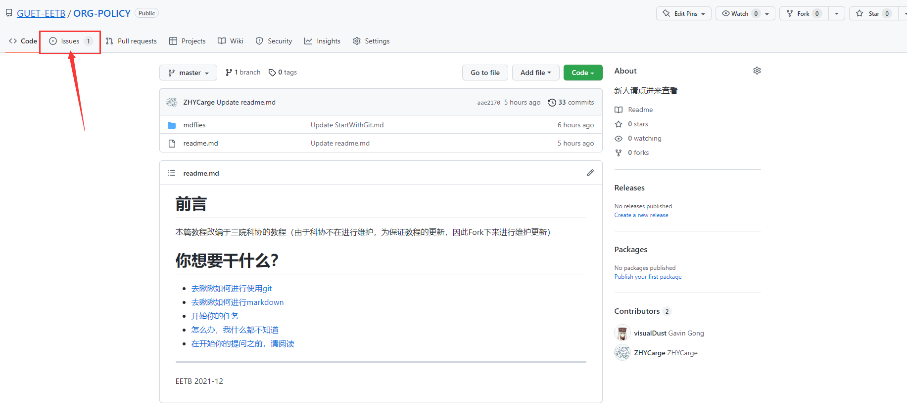
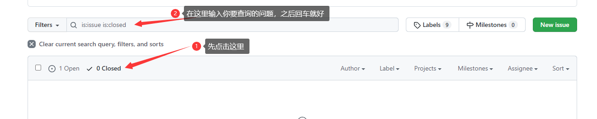
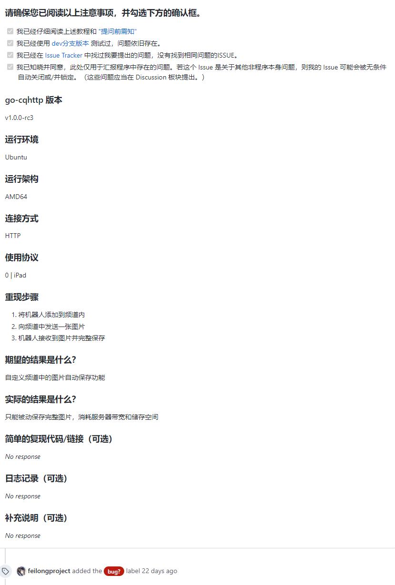
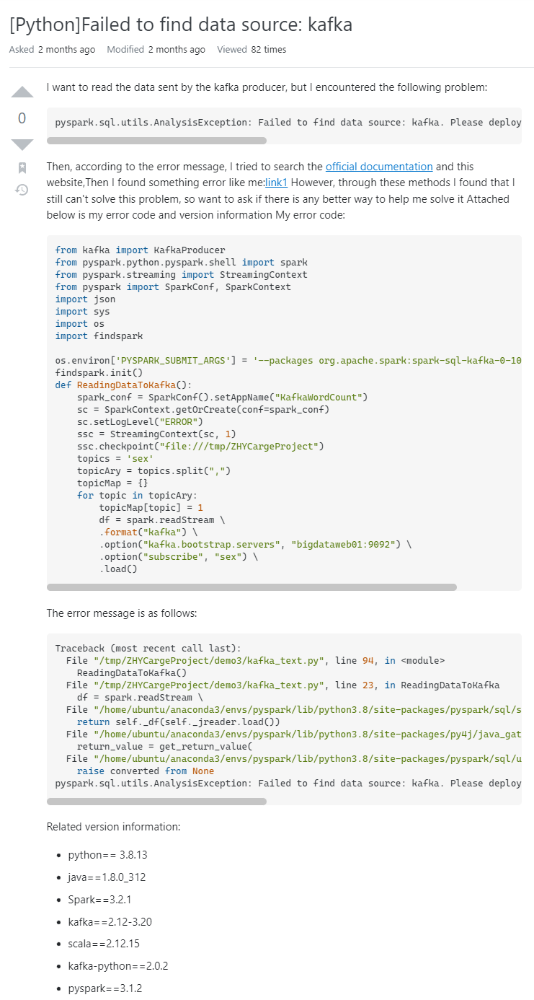
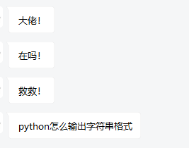

# 前言

为了更加规范大家的提问方式，以及更大程度的提升自身的提问问答效率，编写此文章。

由于GitHub上暂时没有找到比较好的教如何提问issue规范的仓库，因此打算出此文章，浅浅的规范一下大家的提问，从而让你的提问更加的规范化。

由于自身文采有限，如有相关缺陷，欢迎提交PR或提出issue

本篇文章[Mrs4s](https://github.com/Mrs4s)/**[go-cqhttp](https://github.com/Mrs4s/go-cqhttp)**为例

# 如何创建一个issue？

这个很简单。

在每个仓库下都会有一个这样的标识：

点进去之后就会进入到GitHub的提问板块（其他的仓库管理工具也是这样）

点进去之后找到<kbd>New issue</kbd>进行描述你的问题即可完成一个问题的提问

# 在创建一个提问之前我需要做些什么？

这里广义上分为两种情况：

- 我要提问bug或是我遇到了相关问题无法个人解决（比较常见）
- 我要提出一个新建议、新想法

前者可以看后续的文章，后续请充分发挥你的想象力，来进行发挥创作即可

## 我要提问bug或是我遇到了相关问题无法个人解决（比较常见）

在提出这种问题之前，**请先在已关闭的 `issue` / `Discussions` 里查看是否有相同的问题**，如果有相同的遇到此类问题的，可以直接查看他们的问题情况，并且从那里得到相关帮助，查询方式如下：

如果在之前的问题中并没有发现与你相关的内容，那么将可以采用如下内容进行提问：

- **个人的环境信息（如python3.7、windows、Linux）**
- **软件或者项目的版本号是多少？**
- **重现步骤（你是通过什么操作出现了这个问题，是否这个问题在你再次尝试之后再次出现）**
- **我的预期成果是什么？**
- **但是实际输出时什么**
- **如果有日志，那么日志记录了什么？**
- **有什么需要向开发者进行补充的？**

并且在必要情况下结合[《提问的智慧》](https://github.com/GUET-EETB/How-To-Ask-Questions-The-Smart-Way/blob/main/README-zh_CN.md)来帮助你更加有效的向开发者进行描述以及表述相关问题

衷心祝你在有效提问的路上越走越远~

下面贴出有效提问和无效提问的两种例子，仅供参考：

（下面没有啥内容了，可以忽略）

（[链接原址](https://github.com/Mrs4s/go-cqhttp/issues/1628)）

（[链接原址](https://stackoverflow.com/questions/72812187/pythonfailed-to-find-data-source-kafka?noredirect=1#comment128633370_72812187)）

坏问题：

# Reference

- [提问前须知](https://forums.go-cqhttp.org/t/topic/141)
- [提问的智慧](https://github.com/GUET-EETB/How-To-Ask-Questions-The-Smart-Way/blob/main/README-zh_CN.md)

